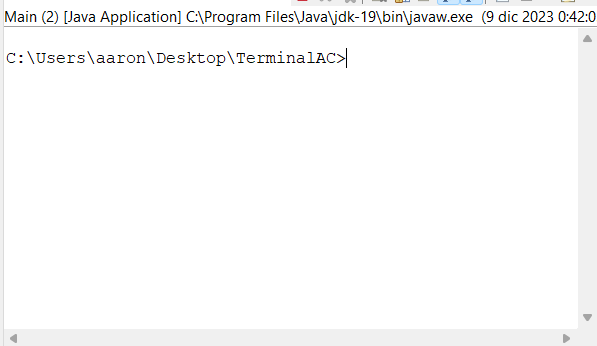
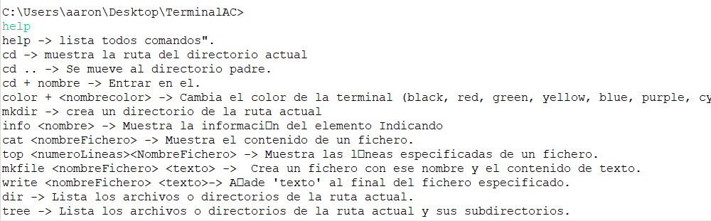
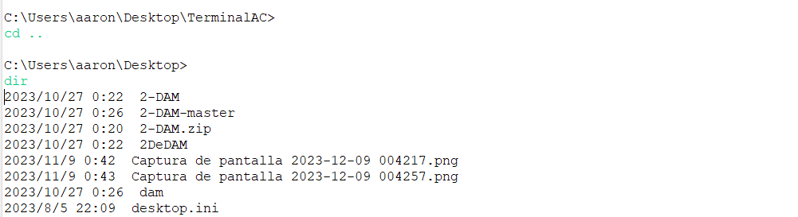

<!-- PROJECT LOGO -->
 

  

<h3 align="center">Windows Terminal Emulation</h3>

  

  

  
  - [About The Project](#about-the-project): The Windows Terminal Emulator is a command-line interface application that replicates the functionality of the Windows Command Prompt with additional features and commands. It provides users with a set of commands for navigating and interacting with the file system and executing various operations..
  

  

- [Commands](#commands): List of available commands and their functions.
  - `help`: Lists all available commands.
  - `cd`: Shows the current directory path.
  - `cd ..`: Moves to the parent directory.
  - `cd + <directory>`: Enters the specified directory.
  - `color + <colorName>`: Changes the terminal color (black, red, green, yellow, blue, purple, cyan, white).
  - `mkdir`: Creates a directory in the current path.
  - `info <name>`: Displays information about the specified element.
  - `cat <fileName>`: Shows the content of a file.
  - `top <numLines> <fileName>`: Displays the specified number of lines from a file.
  - `mkfile <fileName> <text>`: Creates a file with the given name and content.
  - `write <fileName> <text>`: Appends 'text' to the end of the specified file.
  - `dir`: Lists files and directories in the current path.
  - `tree`: Lists files, directories, and subdirectories in the current path.
  - `readpoint <fileName> <position>`: Reads a file from a specific position of the pointer.
  - `delete <name>`: Deletes the file; if it's a directory, deletes its content and itself.
  - `start <program>`: Executes the specified program.
  - `find <name>`: Searches for a file in subdirectories.
  - `rename <oldName> <newName>`: Modifies the name of a file.
  - `close`: Closes the program.
  - `clear`: Clears the command output.
  

  

  
- [Usage](#usage): Import the project into your IDE and execute it! (Made in Eclipse). 
